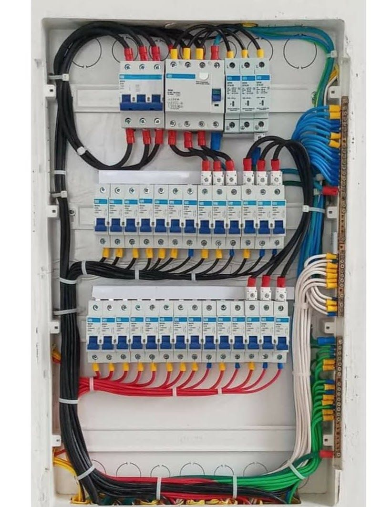
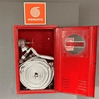
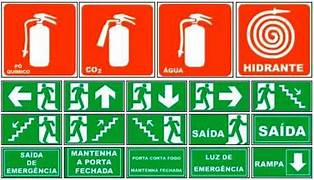

<html lang="pt-BR">
<head>
<meta charset="UTF-8">
<meta name="viewport" content="width=device-width, initial-scale=1.0">
<title>MDA Engenharia | Diagnóstico de Segurança Predial e Manutenção</title>
<meta name="description" content="Vistoria técnica gratuita de segurança predial em Anápolis, Goiânia, Brasília e região. Elétrica, hidráulica, PPCI e acompanhamento de obras. CREA 20.853/D-GO | CREA 25.576/D-GO | CREA 1019077042/D-GO.">
<meta name="robots" content="index, follow">
<meta property="og:type" content="website">
<meta property="og:title" content="MDA Engenharia | Diagnóstico de Segurança Predial e Manutenção">
<meta property="og:description" content="Vistoria técnica de segurança predial em Anápolis e região.">
<meta name="theme-color" content="#0F1B2B">

<link rel="preconnect" href="https://fonts.googleapis.com">
<link rel="preconnect" href="https://fonts.gstatic.com" crossorigin>
<link href="https://fonts.googleapis.com/css2?family=Space+Grotesk:wght@500;600;700&family=IBM+Plex+Sans:wght@400;500;600&family=IBM+Plex+Mono:wght@400;500&display=swap" rel="stylesheet">

</head>
<body>

<header>
  

    

      <svg class="mark" viewBox="0 0 24 24" fill="none"><path d="M3 20L12 4L21 20" stroke="#E8A33D" stroke-width="2" stroke-linejoin="round"/><path d="M7.5 20L12 11.5L16.5 20" stroke="#F7F9F8" stroke-width="2" stroke-linejoin="round"/></svg>
      MDA Engenharia
    

    <nav class="navlinks">
      <a href="#riscos">Riscos Ocultos</a>
      <a href="#solucao">Vistoria Gratuita</a>
      <a href="#servicos">Outros Serviços</a>
      <a href="#contato">Contato</a>
    <nav class="navlinks" aria-label="Públicos atendidos">
      <a href="sindicos.html">Para síndicos</a>
      <a href="administradoras.html">Para administradoras</a>
      <a href="comercios.html">Para comércios</a>
</nav>

    </nav>
    <a href="#contato" class="btn btn-accent btn-sm navcta">Agendar Vistoria</a>
  

</header>

<section class="hero blueprint">
  

    
DIAGNÓSTICO TÉCNICO · CREA 20.853/D-GO | CREA 25.576/D-GO | CREA 1019077042/D-GO

    <h1 class="hero-title">Alvará aprovado não é sinônimo de prédio seguro.</h1>
    
O tempo, o uso diário e as normas que mudaram desde a aprovação do projeto abrem falhas que não existiam no papel. Descubra agora os riscos ocultos do seu imóvel — com uma vistoria técnica sem custo.

    

      <a href="#contato" class="btn btn-accent">Agendar Vistoria Gratuita</a>
      <a href="#riscos" class="btn btn-ghost">Ver Riscos Comuns ↓</a>
    

    

      
●<b>13 anos</b>de atuação em fiscalização, contratos e engenharia de infraestrutura

      
●<b>CREA 20.853/D-GO | CREA 25.576/D-GO | CREA 1019077042/D-GO</b>com visto ativo em CREA-DF

      
●<b>Anápolis e Região</b>atendimento presencial e relatório técnico assinado

    

  

</section>

<section class="riscos" id="riscos">
  

    
01 — Pontos de Atenção

    <h2 class="sec-title">A verdadeira segurança é contínua, não um evento único.</h2>
    
Interaja com as categorias abaixo para entender os pontos críticos que mais aparecem em vistorias reais.

    

      <button class="tabbtn active" data-tab="eletrica">Elétrica &amp; Gás</button>
      <button class="tabbtn" data-tab="incendio">Combate a Incêndio</button>
      <button class="tabbtn" data-tab="estrutura">Estrutura &amp; Infiltrações</button>
      <button class="tabbtn" data-tab="sinalizacao">Sinalização &amp; Fuga</button>
    

    

      <figure class="risco-media">
        
        <figcaption class="mono">FIG. 01 — INSTALAÇÕES ELÉTRICAS &amp; GÁS</figcaption>
      </figure>
      <ul class="risco-list">
        <li>Quadros de energia desatualizados ou sem identificação correta.</li>
        <li>Fiação exposta, ressecada ou com gambiarras.</li>
        <li>Falta de aterramento adequado (SPDA / para-raios) ou de manutenção periódica.</li>
        <li>Vazamentos ou má conservação nas tubulações de gás.</li>
      </ul>
    

    

      <figure class="risco-media">
        
        <figcaption class="mono">FIG. 02 — COMBATE A INCÊNDIO</figcaption>
      </figure>
      <ul class="risco-list">
        <li>Extintores vencidos, obstruídos ou fora do local correto.</li>
        <li>Hidrantes e mangueiras sem teste de pressão, ou com vazamentos.</li>
        <li>Alarmes e detectores de fumaça inoperantes ou sem testes periódicos.</li>
        <li>Portas corta-fogo sem vedação adequada ou travadas abertas.</li>
      </ul>
    

    

      <figure class="risco-media">
        
        <figcaption class="mono">FIG. 03 — ESTRUTURA &amp; INFILTRAÇÕES</figcaption>
      </figure>
      <ul class="risco-list">
        <li>Sinais de infiltração, mofo ou umidade em paredes e tetos.</li>
        <li>Fissuras, trincas ou rachaduras em vigas, pilares e lajes.</li>
        <li>Corrosão em armaduras expostas ou estruturas metálicas.</li>
        <li>Desgaste ou danos em revestimentos, pisos e fachadas.</li>
      </ul>
    

    

      <figure class="risco-media">
        
        <figcaption class="mono">FIG. 04 — SINALIZAÇÃO &amp; ROTAS DE FUGA</figcaption>
      </figure>
      <ul class="risco-list">
        <li>Rotas de fuga obstruídas por móveis, estoque ou lixo.</li>
        <li>Sinalização de emergência apagada, danificada ou inexistente.</li>
        <li>Iluminação de emergência que não funciona ou tem baixa autonomia.</li>
        <li>Guarda-corpos e corrimãos frouxos, com altura inadequada ou corroídos.</li>
      </ul>
    

  

</section>

<section class="solucao" id="solucao">
  

    
02 — Nossa Solução

    <h2 class="sec-title">Um diagnóstico completo, sem custo e sem compromisso.</h2>
    
Nossa equipe avalia todos os aspectos vitais da segurança do imóvel e entrega um relatório técnico com plano de ação — você decide o que e quando priorizar.

    

      Acessibilidade
      Estrutura
      Sistema de Incêndio
      Instalações Elétricas
      Rotas de Fuga
      Sistema de Gás
    

    

      

        
0

        
pontos críticos de segurança avaliados por vistoria

      

      

        
0

        
horas para retorno após a solicitação

      

    

  

</section>

<section class="servicos" id="servicos">
  

    
03 — Além da Vistoria

    <h2 class="sec-title">Enquanto isso, também resolvemos o que já apareceu.</h2>
    
A vistoria gratuita frequentemente revela pequenos reparos e ajustes. Cuidamos deles diretamente, sem precisar contratar outro fornecedor.

    

      

        01
        <h3>Instalações Elétricas</h3>
        
Serviços elétricos, CFTV, alarmes e manutenção técnica especializada.

        <a href="https://wa.me/5561993862269?text=Ol%C3%A1%2C%20quero%20um%20or%C3%A7amento%20de%20instala%C3%A7%C3%B5es%20el%C3%A9tricas.">Solicitar orçamento →</a>
      

      

        02
        <h3>Instalações Hidráulicas</h3>
        
Reparos, instalações e manutenção com precisão técnica e sem desperdício.

        <a href="https://wa.me/5561993862269?text=Ol%C3%A1%2C%20quero%20um%20or%C3%A7amento%20de%20instala%C3%A7%C3%B5es%20hidr%C3%A1ulicas.">Solicitar orçamento →</a>
      

      

        03
        <h3>Projetos &amp; PPCI</h3>
        
Projetos de engenharia, prevenção contra incêndio (PPCI) e segurança do trabalho.

        <a href="https://wa.me/5561993862269?text=Ol%C3%A1%2C%20quero%20saber%20mais%20sobre%20projetos%20de%20PPCI.">Solicitar orçamento →</a>
      

      

        04
        <h3>Acompanhamento de Obras</h3>
        
Consultoria predial, vistorias técnicas e acompanhamento rigoroso de cronograma.

        <a href="https://wa.me/5561993862269?text=Ol%C3%A1%2C%20quero%20saber%20mais%20sobre%20acompanhamento%20de%20obras.">Solicitar orçamento →</a>
      

    

  

</section>

<section class="processo">
  

    
04 — Como Funciona

    <h2 class="sec-title">Três etapas, do primeiro contato ao plano de ação.</h2>
    

      

        
passo 1

        <h3>Agendamento</h3>
        
Você envia o formulário ou chama no WhatsApp. Confirmamos data e horário em até 24h.

      

      

        
passo 2

        <h3>Vistoria no local</h3>
        
Avaliação técnica presencial, cobrindo elétrica, estrutura, incêndio, gás e rotas de fuga.

      

      

        
passo 3

        <h3>Relatório e plano de ação</h3>
        
Você recebe os riscos priorizados e, se quiser, já contrata os reparos com a gente.

      

    

  

</section>

<section class="cta-final" id="contato">
  

    
05 — Comece Hoje

    <h2 class="sec-title" style="color:var(--white);">Proteja seu patrimônio antes que o risco vire prejuízo.</h2>

    

        <form action="https://formspree.io/f/moeqjzrk" method="POST">
        <input type="hidden" name="_subject" value="Novo pedido de vistoria — site MDA Engenharia">
        

       html
<form id="lead-qualification-form" class="lead-form" novalidate>
  <input type="hidden" name="source_page" id="source_page">
  <input type="hidden" name="utm_source" id="utm_source">
  <input type="hidden" name="utm_medium" id="utm_medium">
  <input type="hidden" name="utm_campaign" id="utm_campaign">

  
Etapa 1 de 3<i><b id="form-progress-bar"></b></i>

  <fieldset data-form-step="1">
    <legend>Vamos entender o imóvel.</legend>
    
As respostas ajudam a direcionar a conversa e indicar o próximo passo. Você não precisa ter conhecimento técnico.

    

      <label>Seu nome<input name="name" type="text" autocomplete="name" placeholder="Como podemos chamar você?" required></label>
      <label>Telefone / WhatsApp<input name="phone" type="tel" autocomplete="tel" placeholder="(62) 90000-0000" required></label>
      <label>Você fala em nome de
        <select name="profile" id="lead-profile" required>
          <option value="">Selecione uma opção</option>
          <option value="sindico">Condomínio / síndico</option>
          <option value="administradora">Administradora de condomínios</option>
          <option value="comercio">Comércio ou empresa</option>
          <option value="outro">Outro tipo de imóvel</option>
        </select>
      </label>
      <label>Cidade do imóvel<input name="city" type="text" autocomplete="address-level2" placeholder="Ex.: Anápolis" required></label>
    

    <button type="button" class="btn btn-accent form-next">Continuar →</button>
  </fieldset>

  <fieldset data-form-step="2" hidden>
    <legend>Qual é a necessidade principal?</legend>
    
Selecione o que melhor descreve a situação neste momento.

    

      <label class="choice"><input type="radio" name="need" value="vistoria-inicial" required><b>Vistoria inicial</b><small>Quero identificar riscos e prioridades.</small></label>
      <label class="choice"><input type="radio" name="need" value="laudo-relatorio"><b>Laudo ou relatório técnico</b><small>Preciso documentar uma condição do imóvel.</small></label>
      <label class="choice"><input type="radio" name="need" value="incendio-ppci"><b>Incêndio / PPCI</b><small>Quero revisar prevenção e combate a incêndio.</small></label>
      <label class="choice"><input type="radio" name="need" value="eletrica-gas"><b>Elétrica ou gás</b><small>Tenho uma suspeita ou necessidade de revisão.</small></label>
      <label class="choice"><input type="radio" name="need" value="estrutura-infiltracao"><b>Estrutura / infiltração</b><small>Há sinais que precisam ser investigados.</small></label>
      <label class="choice"><input type="radio" name="need" value="manutencao"><b>Manutenção ou acompanhamento</b><small>Quero organizar correções e continuidade.</small></label>
    

    <label class="wide-label">Conte um pouco mais, se quiser<textarea name="context" rows="4" placeholder="Descreva o que aconteceu, há quanto tempo e se existe alguma urgência percebida."></textarea></label>
    
<button type="button" class="btn btn-outline-dark form-back">← Voltar</button><button type="button" class="btn btn-accent form-next">Continuar →</button>

  </fieldset>

  <fieldset data-form-step="3" hidden>
    <legend>Qual é o melhor próximo passo?</legend>
    
Vamos registrar sua preferência para a equipe responder de forma objetiva.

    

      <label>Prazo desejado
        <select name="timing" required><option value="">Selecione uma opção</option><option value="entender-agora">Quero entender agora</option><option value="proximas-semanas">Nas próximas semanas</option><option value="proximo-mes">No próximo mês</option><option value="sem-prazo">Ainda estou pesquisando</option></select>
      </label>
      <label>Melhor canal
        <select name="preferred_channel" required><option value="">Selecione uma opção</option><option value="whatsapp">WhatsApp</option><option value="telefone">Ligação</option><option value="email">E-mail</option></select>
      </label>
      <label class="wide-label">E-mail (opcional)<input name="email" type="email" autocomplete="email" placeholder="voce@email.com"></label>
    

    <label class="consent"><input name="consent" type="checkbox" required>Autorizo o contato para tratar esta solicitação. Consulte o aviso de privacidade da empresa antes de publicar este formulário.</label>
    
<button type="button" class="btn btn-outline-dark form-back">← Voltar</button><button type="submit" class="btn btn-accent">Enviar e falar com a equipe →</button>

  </fieldset>
  

</form>

<footer>
  

    

      
MDA Engenharia

      
CREA 20.853/D-GO | CREA 25.576/D-GO | CREA 1019077042/D-GO

      
Anápolis/GO | Brasília/DF | Goiânia/GO e Região

    

    

      
(61) 99386-2269

      
mdaengenharia.contato@gmail.com

    

    

      <a href="#riscos">Riscos Ocultos</a> 
      <a href="#servicos" style="display:inline-block;margin-top:6px;">Outros Serviços</a>
    

  

  

    © 2026 MDA Engenharia — Segurança Contínua.
  

</footer>

html

</body>
</html>
